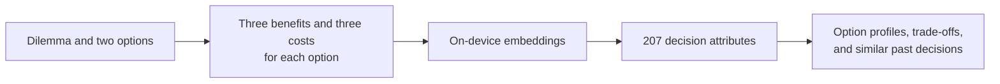

<p align="center">
  
</p>

<h1 align="center">Dilemma</h1>

<p align="center">
  <strong>A private decision journal that helps you see the values behind your options.</strong>
</p>

<p align="center">
  
  
  
  
</p>

Dilemma helps you think through a choice between two options. You record the benefits and costs of each option, examine the competing priorities, and keep a record of your reasoning. The semantic model runs on your device: there is no account, backend, or upload of your personal text.

The app does not decide for you. It makes your reasoning easier to inspect and lets you draw on similar choices you have made before.

See the [screenshots page](docs/screenshots.md) for the journal, dilemma view, decision feedback, and similar dilemmas.

## Why Dilemma

- **More than a pros-and-cons list.** The app compares your reasons with 207 decision attributes to highlight what matters in each option.
- **On-device analysis.** Dilemma texts, reasons, embeddings, results, and feedback stay on your device.
- **Russian and English support.** The app bundles the multilingual `paraphrase-multilingual-MiniLM-L12-v2` model.
- **Your history, without cloud training.** Recorded decisions help the app find similar dilemmas and show which option you chose in comparable situations.
- **Control over your data.** Import individual dilemmas from JSON, export the full journal, or delete it.

## How it works



You describe two options and give three benefits and three costs for each. `DecisionKernel` encodes the 12 reasons with a local embedding model, compares them with the research attribute set, and builds a profile for each option. The result is saved in your private journal. You can also record the choice you eventually make.

## Features

- Create and analyze structured dilemmas locally.
- See the strongest positive and negative attributes for each option.
- Examine the main trade-offs between options.
- Find semantically similar entries in your own journal.
- Get a likely-choice hint based **only on past decisions you recorded**.
- View statistics about journal entries and recorded decisions.
- Import individual dilemmas and export the full journal as JSON.
- Delete one entry or all user data.
- Use the Russian or English interface in light or dark mode.

## Quick start

### Requirements

- macOS with Xcode 16 or later.
- An iOS 18+ Simulator or a physical device.
- [Tuist 4](https://docs.tuist.dev/en/guides/quick-start/install-tuist).
- Python 3.12 to prepare model assets.
- About 500 MB of free space for the main multilingual model.

### Run the app

```bash
# 1. Install Tuist
brew tap tuist/tuist
brew install --formula tuist

# 2. Create a Python environment
/opt/homebrew/bin/python3.12 -m venv .venv
.venv/bin/pip install -r tools/requirements.txt

# 3. Download the local model
.venv/bin/python tools/download_bundled_model.py \
  --model paraphrase-multilingual-MiniLM-L12-v2

# 4. Generate and open the Xcode workspace
./tools/generate_project.sh --open
```

In Xcode, select the `dilemma` scheme and run it on an iOS 18+ Simulator. The model is downloaded while preparing the project; the app does not contact Hugging Face at runtime.

## Architecture

| Module | Responsibility |
| --- | --- |
| `dilemma` | SwiftUI interface, navigation, localization, and composition root |
| `DecisionModels` | Shared commands and models for journal entries, analyses, feedback, and export |
| `DecisionUseCases` | User workflows across the interface, analysis engine, and storage |
| `DecisionKernel` | Embeddings, attribute scoring, trade-offs, and similarity |
| `DiaryVault` | Private SQLite storage for entries, analyses, and feedback |

The UI does not access the analysis engine or database directly. The engine does not know about user storage, and `DiaryVault` is the only module that persists private data. See the [architecture document](docs/architecture.md) for details.

## Tech stack

| Purpose | Technology |
| --- | --- |
| Interface | SwiftUI, Observation |
| Language | Swift 6 |
| Project generation | Tuist |
| On-device embeddings | [`swift-embeddings`](https://github.com/jkrukowski/swift-embeddings) |
| Main model | `sentence-transformers/paraphrase-multilingual-MiniLM-L12-v2` |
| Storage | SQLite3 |
| Tests | Swift Testing, pytest |

## Performance

Baseline for analyzing one dilemma with 12 reasons on an iPhone 16 Simulator running iOS 18.2:

| Stage | Time |
| --- | ---: |
| Model loading | 561.9 ms |
| Embedding generation | 127.6 ms |
| Scoring and aggregation | 11.8 ms |

These are simulator measurements, not a guarantee for every device. The method, memory baseline, and release checks are documented in [MVP release prep](docs/mvp_release_prep.md).

## Tests

The full integration and experiment suite also needs the English L12 model:

```bash
.venv/bin/python tools/download_bundled_model.py --model all-MiniLM-L12-v2
./tools/generate_project.sh

xcodebuild test \
  -workspace dilemma.xcworkspace \
  -scheme dilemma \
  -destination 'platform=iOS Simulator,name=iPhone 16,OS=18.2'
```

To check only the offline assets:

```bash
.venv/bin/python -m pytest tools/test_attribute_assets.py
```

See [DecisionKernelTests/README.md](DecisionKernelTests/README.md) for more kernel and similarity experiment commands.

## Research background

The project's attribute set draws on Sudeep Bhatia and colleagues' [“Computational analysis of 100 K choice dilemmas: Decision attributes, trade-off structures, and model-based prediction”](https://doi.org/10.1073/pnas.2406489122), PNAS, 2025.

The production asset contains 207 decision attributes. Embeddings and SQLite assets are generated offline by scripts in `tools/`; the app uses the prepared read-only resources.

The related public study is [Attribute Projections for Conflict Similarity in Text Embeddings](https://github.com/sarrumkin/concept-projection-dilemmas). Its English README and notebook provide the data, figures, and reproduction paths. Concept207 is the primary representation studied; Hybrid50 is a secondary hypothesis.

```bash
.venv/bin/python tools/generate_attribute_assets.py \
  --model paraphrase-multilingual-MiniLM-L12-v2 \
  --quality-report reports/quality_multi_l12.json \
  --baseline-quality-report reports/quality_l12.json

.venv/bin/python tools/generate_production_assets.py
```

## Repository layout

```text
.
├── dilemma/                 # iOS app and SwiftUI features
├── DecisionModels/          # shared domain models
├── DecisionUseCases/        # application workflows
├── DecisionKernel/          # local analysis engine and assets
├── DiaryVault/              # private SQLite storage
├── *Tests/                  # unit, integration, and experiment suites
├── tools/                   # model and dataset preparation
├── reports/                 # quality and performance reports
├── docs/                    # architecture and release preparation
└── Project.swift            # Tuist manifest
```

## Project status

Dilemma is a research MVP. Local analysis, the journal, feedback, statistics, import and export, and privacy controls are implemented. Testing on physical devices and final QA are still needed before shipping the app.

## Development history

[Commits on `main`](https://github.com/sarrumkin/dilemma/commits/main) show how the app developed over time; [other branches](https://github.com/sarrumkin/dilemma/branches) preserve parallel experiments and work stages. The original authorship and commit dates were retained. A local journal export was removed from the history before publication, so some commit hashes changed.

## License

The source code is available under the [MIT License](LICENSE). See [NOTICE](NOTICE) for attribution and license details for the Bhatia materials.
