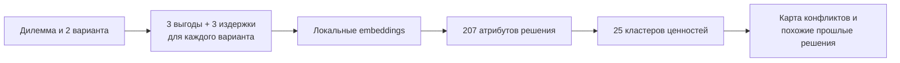
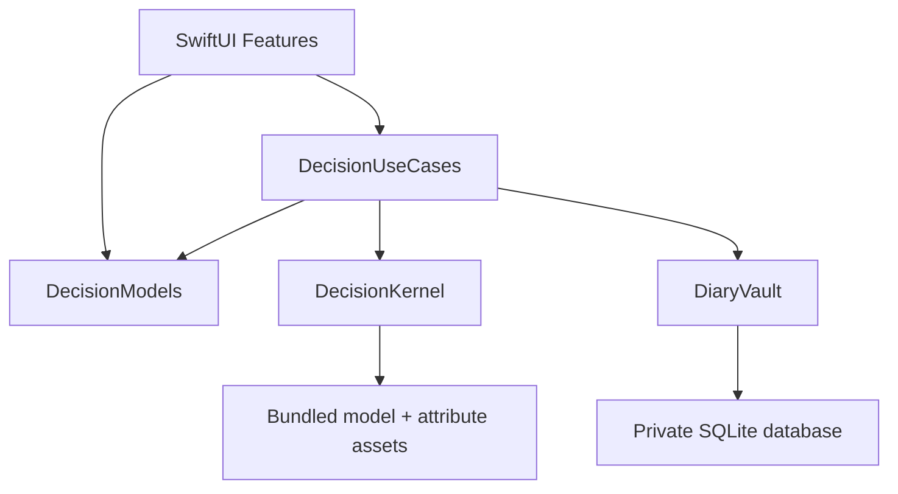

<p align="center">
  
</p>

<h1 align="center">Dilemma</h1>

<p align="center">
  <strong>Приватный дневник решений, который помогает увидеть не только варианты — но и ценности за ними.</strong>
</p>

<p align="center">
  
  
  
  
</p>

Dilemma помогает разобрать сложный выбор между двумя вариантами: структурировать выгоды и издержки, найти скрытые конфликты ценностей и сохранить ход размышлений. Семантическая модель работает прямо на устройстве — без аккаунта, backend и отправки личного текста на сервер.

Это не приложение, которое решает за человека. Оно делает решение **объяснимым**: показывает, что на самом деле конкурирует внутри дилеммы, и со временем помогает опираться на собственный опыт похожих выборов.

## Почему Dilemma

- **Глубже обычного списка «за и против».** Аргументы сопоставляются с 207 атрибутами решений и собираются в 25 смысловых кластеров: от безопасности и карьеры до отношений и благополучия.
- **Полностью локальный анализ.** Текст дилемм, причины, embeddings, результаты и обратная связь остаются на устройстве.
- **Работает на русском и английском.** В приложение встроена мультиязычная модель `paraphrase-multilingual-MiniLM-L12-v2`.
- **Опирается на вашу историю — без обучения в облаке.** Отмеченные решения используются, чтобы находить похожие дилеммы и показывать, какой вариант вы чаще выбирали в сопоставимых ситуациях.
- **Данные принадлежат пользователю.** Дилеммы можно импортировать из JSON, весь дневник — экспортировать или удалить целиком.

## Как это работает



Пользователь описывает два варианта и по три выгоды и издержки для каждого. `DecisionKernel` кодирует 12 причин локальной embedding-моделью, сопоставляет их с исследовательской таксономией и строит профили вариантов. Результат сохраняется в личном дневнике вместе с финальным выбором — если пользователь решит его отметить.

## Возможности

- создание и локальный анализ структурированных дилемм;
- сильнейшие положительные и отрицательные атрибуты каждого варианта;
- тематические кластеры и карта ключевых конфликтов;
- поиск семантически похожих записей в личном дневнике;
- подсказка о вероятном выборе на основе **только отмеченных прошлых решений**;
- статистика по записям, решениям и повторяющимся темам;
- импорт отдельных дилемм и экспорт всего дневника в JSON;
- удаление одной записи или всех пользовательских данных;
- русский и английский интерфейс, светлая и тёмная темы.

## Быстрый старт

### Требования

- macOS и Xcode 16+;
- iOS 18+ Simulator или физическое устройство;
- [Tuist 4](https://docs.tuist.dev/en/guides/quick-start/install-tuist);
- Python 3.12 для подготовки model assets;
- около 500 МБ свободного места для основной мультиязычной модели.

### Запуск

```bash
# 1. Установите Tuist
brew tap tuist/tuist
brew install --formula tuist

# 2. Подготовьте Python-окружение
/opt/homebrew/bin/python3.12 -m venv .venv
.venv/bin/pip install -r tools/requirements.txt

# 3. Загрузите локальную модель
.venv/bin/python tools/download_bundled_model.py \
  --model paraphrase-multilingual-MiniLM-L12-v2

# 4. Сгенерируйте workspace и откройте его в Xcode
./tools/generate_project.sh --open
```

В Xcode выберите схему `dilemma` и запустите приложение на iOS 18+ Simulator. Модель скачивается только на этапе подготовки проекта; runtime приложения не обращается к Hugging Face.

## Архитектура



| Модуль | Ответственность |
| --- | --- |
| `dilemma` | SwiftUI-интерфейс, навигация, локализация и composition root |
| `DecisionModels` | Общие команды, модели дневника, анализа, feedback и export DTO |
| `DecisionUseCases` | Пользовательские сценарии и оркестрация между UI, анализом и хранилищем |
| `DecisionKernel` | Embeddings, scoring, кластеризация, конфликты и similarity |
| `DiaryVault` | Приватное SQLite-хранилище записей, анализов и обратной связи |

Граница зависимостей намеренная: UI не обращается к kernel или базе напрямую, kernel ничего не знает о пользовательском хранилище, а `DiaryVault` — единственный модуль, который сохраняет приватные данные. Подробнее — в [документе об архитектуре](docs/architecture.md).

## Технологии

| Задача | Решение |
| --- | --- |
| UI | SwiftUI, Observation |
| Язык | Swift 6 |
| Генерация проекта | Tuist |
| Локальные embeddings | [`swift-embeddings`](https://github.com/jkrukowski/swift-embeddings) |
| Основная модель | `sentence-transformers/paraphrase-multilingual-MiniLM-L12-v2` |
| Хранение | SQLite3 |
| Тестирование | Swift Testing, pytest |

## Производительность

Текущий baseline для анализа одной дилеммы из 12 аргументов на iPhone 16 Simulator / iOS 18.2:

| Этап | Время |
| --- | ---: |
| Загрузка модели | 561,9 мс |
| Построение embeddings | 127,6 мс |
| Scoring и агрегация | 11,8 мс |

Это измерения симулятора, а не обещание для любого устройства. Полная методика, memory baseline и release-gate описаны в [MVP release prep](docs/mvp_release_prep.md).

## Проверка проекта

Для полного набора интеграционных и экспериментальных тестов дополнительно понадобится английская L12-модель:

```bash
.venv/bin/python tools/download_bundled_model.py --model all-MiniLM-L12-v2
./tools/generate_project.sh

xcodebuild test \
  -workspace dilemma.xcworkspace \
  -scheme dilemma \
  -destination 'platform=iOS Simulator,name=iPhone 16,OS=18.2'
```

Проверить только offline assets:

```bash
.venv/bin/python -m pytest tools/test_attribute_assets.py
```

Подробные команды для kernel и similarity-экспериментов собраны в [DecisionKernelTests/README.md](DecisionKernelTests/README.md).

## Исследовательская основа

Таксономия проекта опирается на работу Sudeep Bhatia и соавторов — [«Computational analysis of 100 K choice dilemmas: Decision attributes, trade-off structures, and model-based prediction»](https://doi.org/10.1073/pnas.2406489122), PNAS, 2025.

В production asset зафиксированы 207 атрибутов и восстановленная Ward-кластеризация по реальным описаниям вариантов выбора. Генерация embeddings и сборка SQLite assets выполняются offline и воспроизводятся скриптами из `tools/`; приложение использует уже подготовленные read-only ресурсы.

Актуальная публичная редакция исследования: [Attribute Projections for Conflict Similarity in Text Embeddings](https://github.com/sarrumkin/concept-projection-dilemmas). Английские README и notebook, все данные, графики и два режима воспроизведения; Concept207 — основной предмет исследования, Hybrid50 — второстепенная гипотеза.


```bash
.venv/bin/python tools/generate_attribute_assets.py \
  --model paraphrase-multilingual-MiniLM-L12-v2 \
  --quality-report reports/quality_multi_l12.json \
  --baseline-quality-report reports/quality_l12.json

.venv/bin/python tools/generate_production_assets.py
```

## Структура репозитория

```text
.
├── dilemma/                 # iOS app и SwiftUI features
├── DecisionModels/          # общие domain-модели
├── DecisionUseCases/        # application layer
├── DecisionKernel/          # локальный analysis engine и assets
├── DiaryVault/              # приватное SQLite-хранилище
├── *Tests/                  # unit, integration и experiment suites
├── tools/                   # подготовка моделей и datasets
├── reports/                 # quality и performance reports
├── docs/                    # архитектура и release prep
└── Project.swift            # Tuist manifest
```

## Статус проекта

Dilemma находится на стадии исследовательского MVP. Локальный анализ, дневник, feedback, статистика, импорт/экспорт и privacy controls реализованы; перед публичным релизом остаются проверки на физических устройствах и финальный QA.

## Лицензия

Лицензия пока не опубликована. До появления файла `LICENSE` исходный код доступен для просмотра, но права на копирование, изменение и распространение явно не предоставлены.
