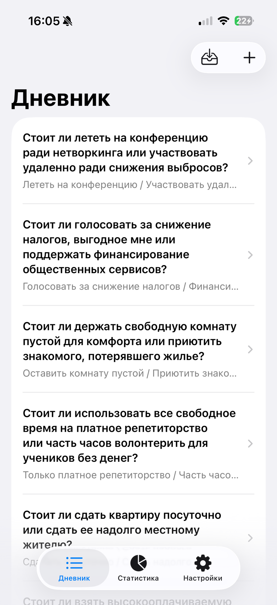
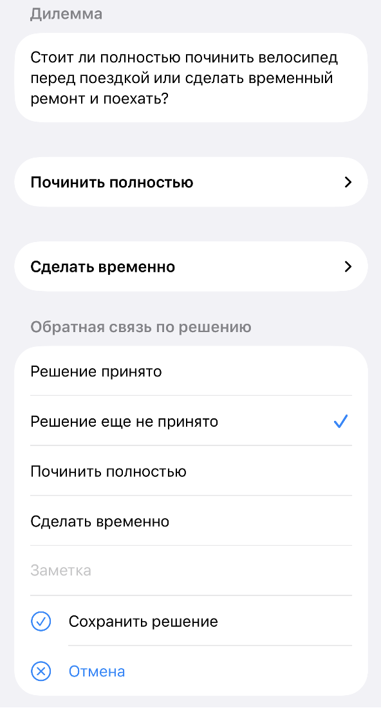
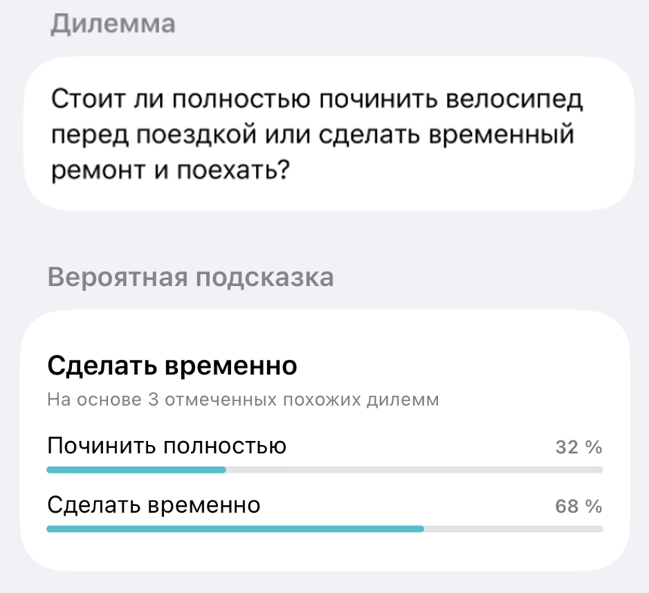
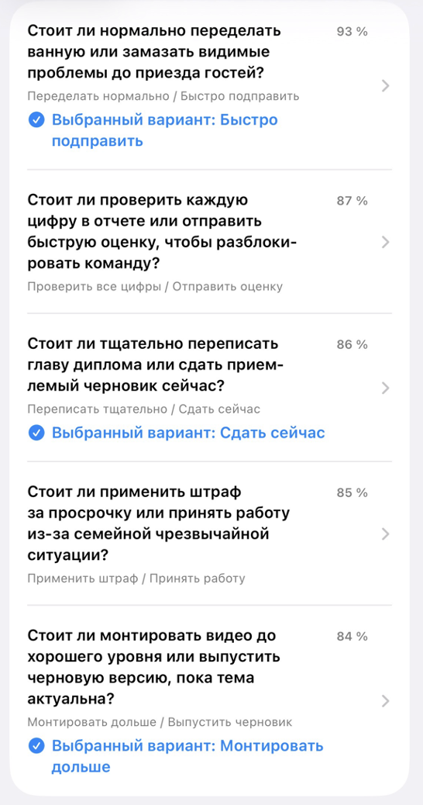

# App screenshots

These screenshots show the Russian interface of Dilemma.

## Journal

The main screen lists saved dilemmas and provides actions to import or create a new entry.

## Dilemma and decision feedback

The two options and the form for recording a decision.

## Likely-choice hint

A hint based on three similar dilemmas with recorded choices.

## Similar dilemmas

Past dilemmas ranked by similarity, with recorded choices where available.

[Back to README](../README.md)
